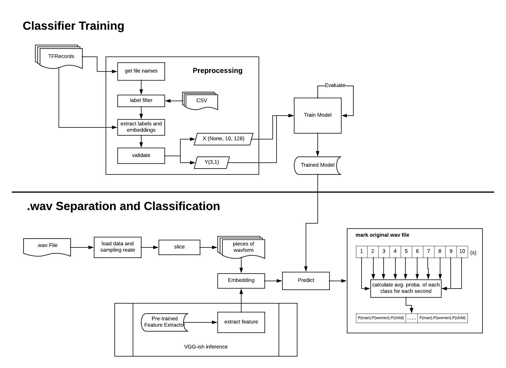
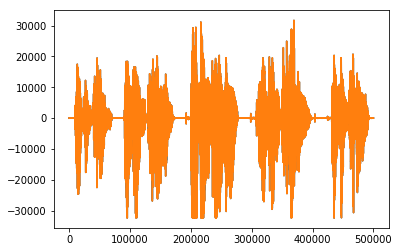
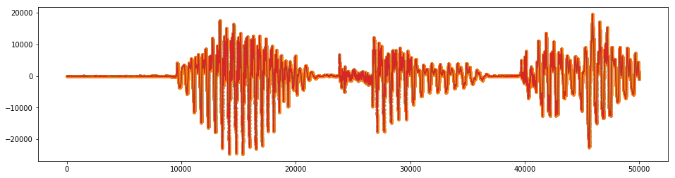
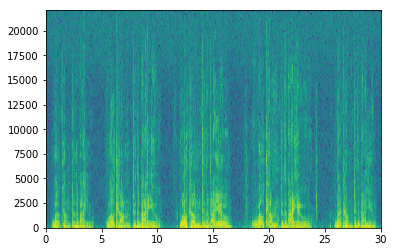
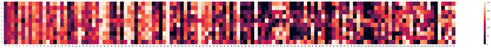
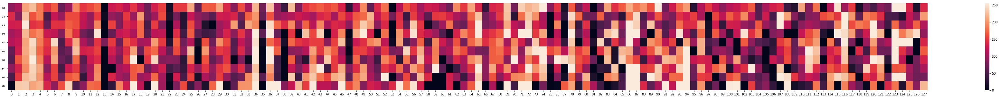
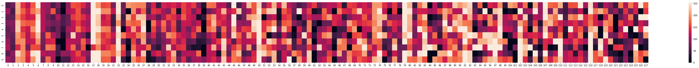
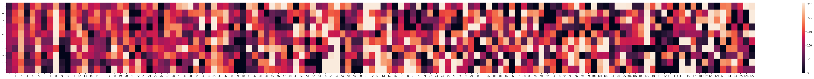

# Gender-based Vocal Recognition
> Final Project of CSYE7374 Cognitive Computing
--- 


#### Members:
Shiqi Dai<br>
Wenqi Cui
#### Advisor:
Sri Krishnamurthy

--- 
## Table of Content

- [Topic Description](#topic-description)
- [Data Sources](#data-sources)
- [Pipeline Design](#pipeline-design)
- [Data Collection](#data-collection)
  + [Preprocessing](#Preprocessing)
    * [What is TFRecord](#what-is-tfrecord)
    * [Label Filter](#label-filter)
    * [Retrieve Embeddings](#retrieve-embeddings)
- [The Sound File: WAV](#the-sound-file--wav)
  + [Load a WAV file](#load-a-wav-file)
  + [Waveform](#waveform)
  + [Spectrogram](#spectrogram)
- [Classifiers Training](#classifiers-training)
  + [Input Tensor](#input-tensor)
  + [CNN(Convolutional Neural Network)](#cnn-convolutional-neural-network-)
    * [Two-dimensional convolutional neural network](#two-dimensional-convolutional-neural-network)
    * [One-dimensional convolutional neural network](#one-dimensional-convolutional-neural-network)
  + [MLP(Mltilayer Perceptron)](#mlp-mltilayer-perceptron-)
  + [Evaluation](#evaluation)
  + [Ensemble](#ensemble)
- [New-coming WAV File Separation](#new-coming-wav-file-separation)
  + [Slicing](#slicing)
  + [Embedding](#embedding)
  + [Feeding to the Model](#feeding-to-the-model)
  + [Output Separation](#output-separation)
- [Future Steps](#future-steps)
  + [YouTube Data Collection](#youtube-data-collection)
  + [Silence Detection](#silence-detection)
- [References](#references)


## Topic Description

In Gender-based Vocal Recognition, we designed classifiers which are used to recognize the gender of a speaker from a given speech audio file(WAV format), in other words, to classify audio files to genders(male and female).

The data source is AudioSet provided by Google Research. It is a large scale audio dataset collected from YouTube videos. We will build machine learning models with TensorFlow,  trying some wildly used neural networks such as CNN, RNN. Different models for the model evaluation are taken to obtain the best model. Afterward, our product can process the newly coming WAV files, automatically applying feature engineering and generating training examples in memory-friendly data format. Finally, use our pre-trained neural network model to label it for future research usage.

Achievement of our project could be precious on video/audio labeling, and it helps to generate more data for further study. For example, building a separator to separate an audio conversation file into two part according to different speakers. Combined with IoT technology which becomes more and more popular these days, our project is helpful in empowering “smart home.” For example, virtual assistants, such as Siri or Alexa, can use our product to validate if the voice of a particular user has access. 

## Data Sources
> AudioSet is provided by Google Research. It consists of an expanding ontology of 632 audio event classes and a collection of 2,084,320 human-labeled 10-second sound clips drawn from YouTube videos.

We used 3 parts of data from AudioSet. They are:
  1. Male speech, man speaking  [link](https://research.google.com/audioset/ontology/male_speech_man_speaking_1.html)
  2. Female speech, woman speaking  [link](https://research.google.com/audioset/ontology/female_speech_woman_speaking_1.html) 
  3. Child speech, kid speaking  [link](https://research.google.com/audioset/ontology/child_speech_kid_speaking_1.html)
 
In which, 1, 2, and 3 are used to train classifier(s) that recognize different types of human voice. 

## Pipeline Design

There two main parts of our project. 

First is `Classifier Training`. This part works as our core. It uses AudioSet data to train classifiers which are used by the next part. 

The second part is `.wav Separation and Classification`. This part is for classifying and separation on a future sound file. It first applies preprocessing and feature engineering, then use our classifier to predict, finally using our scoring criteria to mark the original wav file.


## Data Collection

Google Research offers the AudioSet dataset for download in two formats:
1. **Text (CSV) files** describing, for each segment, the YouTube video ID, start time, end time, and one or more labels.
2. **128-dimensional audio features** extracted at 1Hz. The audio features were extracted using a VGG-inspired acoustic model described in Hershey et al., trained on a preliminary version of YouTube-8M. The features were PCA-ed and quantized to be compatible with the audio features provided with YouTube-8M. They are stored as TensorFlow Record files. 

To use the extracted features dataset, both of 1 and 2 need to be downloaded. 

#### 128-dimensional audio features
They have been stored in 12,228 **TensorFlow record files**, shared by the first two characters of the YouTube video ID, and packaged as a tar.gz file. There are two ways provided by Google to download the features dataset(2):
- Manually download the tar.gz file
- Use gsutil rsync, with commands- 

The labels are stored as integer indices. They are mapped to sound classes via `class_labels_indices.csv`. 


#### Text (CSV) files
In the CSV file, 

The first line defines the column names. Subsequent lines describe the mapping for each class. For example: 

|index |mid      |display_name  |
| ---- | ------- | ------------ |
|0     |/m/09x0r |"Speech"      |


This means the index 0 indicates the label `“Speech”`.

### Preprocessing
For downloaded dataset, audio data(frame-level features) is stored in TensorFlow.SequenceExample protocol buffers in TFRecord files. 

A SequenceExample is an Example representing one or more sequences and some context. The context contains features which apply to the entire example. The feature_lists contain a key, value map where each key is associated with a repeated set of Features (a FeatureList). A FeatureList thus represents the values of a feature identified by its key overtime / frames.

All the feature information provided in AudioSet is extracted and represented already as embeddings by a pre-trained neural network model as feature extractor.

So the main point left to us is how to retrieve those embeddings from TFRecord files.

#### What is TFRecord
TFRecord is a **binary** storage file format introduced by TensorFlow. The benefits of choosing TFRecord to store features is explained by Thomas Gamauf on [here](<https://medium.com/mostly-ai/TensorFlow-records-what-they-are-and-how-to-use-them-c46bc4bbb564>).

One TFRecord may contain the embeddings of several data points in several objects of `tensorflow.SequenceExample`. 

According to [Download - AudioSet](<https://research.google.com/audioset/download.html>), a typical `tensorflow.SequenceExample` proto is reproduced here in text format:
```
context: {
  feature: {
    key  : "video_id"
    value: {
      bytes_list: {
        value: [YouTube video id string]
      }
    }
  }
  feature: {
    key  : "start_time_seconds"
    value: {
      float_list: {
        value: 6.0
      }
    }
  }
  feature: {
    key  : "end_time_seconds"
    value: {
      float_list: {
        value: 16.0
      }
    }
  }
  feature: {
    key  : "labels"
      value: {
        int64_list: {
          value: [1, 522, 11, 172] # The meaning of the labels can be found here.
        }
      }
    }
}
feature_lists: {
  feature_list: {
    key  : "audio_embedding"
    value: {
      feature: {
        bytes_list: {
          value: [128 8bit quantized features]
        }
      }
      feature: {
        bytes_list: {
          value: [128 8bit quantized features]
        }
      }
    }
    ... # Repeated for every second of the segment
  }

}
```
From above, the  `feature_lists` contains embeddings data as `bytes_list` which is precisely what we want, the 128-dimensional embedded features.

#### Label Filter
When read in embedded features from TFRecord, due to the huge size of data and time consumption of loading data, we want to load only those samples with labels that satisfying our requirements to our system.

In our project, we only want to use male, female, and child audio data. However, the downloaded TFRecords is the whole AudioSet. Thus, we need to create a criterion which plays as a query to help us retrieve only data in the classes we want. 

This comes to our `label_criteria` which contains two lists, one for the classes we want, another for the class(es) we don't want.
 >Note: In AudioSet, each 10s labeled example may have several labels. Not all of those labels are manually generated. Some of them generated by the title of the video, others may be generated by image detection and classification, and so on. Thus, not all the labels given are correct. For example, we found there are some samples labeled as "man speaking" along with "animal" are male lions' roar. This is the reason we added `not_use` into our criteria.

```python
use=[male,female,child]
not_use=[animal]
```

With the `label_criteria`, we can generate `target_file_list` which will be used later when choosing TFRecord files to read. For you reference, here is the code we use to generate the `target_file_list`:
```python
arr=[False]*labels.shape[0]
print("Building...")
for lab in use:
    for i in range(1,13):
        arr=merge_or(arr,labels['label_'+str(i)].str.contains(lab))
        
        
print("Excluding...")       
not_arr=[True]*labels.shape[0]
for lab in not_use:
    for i in range(1,13):
        tem=merge_not(labels['label_'+str(i)].str.contains(lab))
        not_arr=merge_and(not_arr,tem)

fin_arr = merge_and(arr,not_arr)
useful = [s[:2] for s in labels[fin_arr]['YTID']]
lis=[]
print("Almost...")
for s in useful:
    for file in file_list:
        if s == file[:2]:
            lis.append(file)
print("Get list done...")
return lis

```

#### Retrieve Embeddings

1. Open TFRecord file(s) according to `target_file_list` generated by `Label Filter`
2. Validate sample based on actual labels according to our `label_criteria`.
3. Extract embeddings of a validated sample.

Because one TFRecord may contain multiple samples, 2 and 3 may be called iteratively. For your reference, please check [audioclassifier.py](utils/audioclassifier.py)

## The Sound File: WAV
>Waveform Audio File Format (WAVE, or more commonly known as WAV due to its filename extension; is a Microsoft and IBM audio file format standard for storing an audio bitstream on PCs. For more [details](<https://en.wikipedia.org/wiki/WAV>)

Usually, we care about two variables when loading a wav file. They are:

- **Frame**: An audio frame, or sample, contains amplitude (loudness) information at that particular point in time. To produce sound, tens of thousands of frames are played in sequence to produce frequencies.
- **Sampling Rate**: In the case of our audio data which is in CD quality audio, there are around 44,100 frames/samples per second, which means the sampling rate is 44.1kHz. This number is widely used today. 

By using `frames` and `sampling_rate`, we are able to calculate the duration of a wav file by simply taking `duration` = `frames` / `sampling_rate`.

Our project is taking 16-bits audio, which means each of those frames contains 16-bits of resolution, allowing for reasonably precise representations of the sound levels. Also, because CD audio is stereo, there is twice as much information, 16-bits for the left channel, 16-bits for the right.

When you use the sound module in python to get a frame, it is returned as a series of hexadecimal characters:

- Two characters for 16-bit mono.
- Four characters for 16-bit stereo.

We can use the python wave module's functions to check the bit depth and number of channels to prevent comparing mismatched quality settings.


### Load a WAV file
There are several python packages allow you to load a WAV file. In Jupyter Notebook, we can also add a player to listen to the WAV file.
```python
import IPython.display as ipd
fname = './data/'  + '364971__balloonhead__welcome-to-the-bayou.wav'
ipd.Audio(fname)
```
Like this:


#### Using wave library
```python
import wave
wav = wave.open(fname)

frames = getnframes()
sampling_rate = getframerate()

duration = wav.getnframes()/wav.getframerate()

print("Sampling (frame) rate = ", wav.getframerate())
print("Total samples (frames) = ", wav.getnframes())
print("Duration = ", duration)
```
Output
```
Sampling (frame) rate =  44100
Total samples (frames) =  500224
Duration =  11.34294784580499
```

#### Using scipy
```python
from scipy.io import wavfile
rate, data = wavfile.read(fname)
print("Sampling (frame) rate = ", rate)
print("Total samples (frames) = ", data.shape)
print(data)
```
Output
```
Sampling (frame) rate =  44100
Total samples (frames) =  (500224, 2)
[[-5 -3]
 [ 2 -7]
 [-6 -6]
 ...
 [28 25]
 [26 25]
 [29 22]]
```
### Waveform
To visualize an audio data, we can plot its waveform.
```python
import matplotlib.pyplot as plt
plt.plot(data, '-', )
```
Output



Let's zoom in on first 50000 frames
```python
plt.figure(figsize=(16, 4))
plt.plot(data[:50000], '.'); plt.plot(data[:50000], '-')
```
Output



### Spectrogram
#### What is Spectrograms?
A spectrogram is a visual representation of the spectrum of frequencies of sound or other signals as they vary with time. 
#### Why use spectrograms?
Spectrograms of sounds turn out to be quite useful for training 2d convolutional networks. The feature extractor provided by Google Research also need to convert input data from audio waveform to mel spectrogram features.

#### Plot Spectrogram
To plot a spectrogram, we can use `pyplot`
```python
plt.specgram(data[:,0], Fs=sample_rate, xextent=(0,30))
plt.show()
```



## Classifiers Training
The primary approach for the classifiers training is neural-network-based. Typical neural network types include CNN(Convolutional Neural Network), RNN(Recurrent Neural Network). Specific customization is taken if necessary. 

### Input Tensor
The input size for all models we used is uniformed, which is 10 * 128. The first dimension is time. There are ten seconds for each sample, and for each second, there are 128 dimensions of features. We made a few visualization of our samples.
- Male speaking #1


- Male speaking #2


- Female speaking


- Child speaking


In those heat maps, the shades of color are from 0(white) to 255(black). The time is in the vertical dimension and 128 features are distributed in the horizontal dimension. 

What we need to point out is the 128 features are not directly output of the pre-trained VGGish model. Instead, they are PCA-ed features. Thus every digit from the 128 features is independent. This is important because we used 2D convolutional neural network at the first place. Then we found the accuracy is not as expected. By knowing the independence of features, we decided to use 1D convolutional neural network and it turned out to be satisfying.

### CNN(Convolutional Neural Network)
Typically, CNNs are used on image/audio data. It plays a vital role in cognitive computing like image/voice recognition. 

#### Two-dimensional convolutional neural network
2D convolutional neural network is the first model we tried because we got inspired from the pre0trained VGGish embedding model. We implemented a simple VGG-resembling Conv2D model consisting of several VGG modules. A typical VGG module is:
1. Conv2D layer with ReLu activation
2. Batch normalization layer
3. Max pooling layer
4. Dropout layer

We tried different combination of VGG modules and hyper parameters like neurons, dropout rate, etc.

#### One-dimensional convolutional neural network
As mentioned above, we decided to use 1D CNN is because our features do not have any relations in horizontal(128) dimension. But in the vertical dimension--time, the data should have some relations. A 1D conv model would allow us to get the high level feature from the time dimension of a sample input. This should give us better performance.
```_________________________________________________________________
Layer (type)                 Output Shape              Param #   
=================================================================
conv1d_63 (Conv1D)           (None, 10, 64)            24640     
_________________________________________________________________
batch_normalization_175 (Bat (None, 10, 64)            256       
_________________________________________________________________
conv1d_64 (Conv1D)           (None, 10, 64)            12352     
_________________________________________________________________
batch_normalization_176 (Bat (None, 10, 64)            256       
_________________________________________________________________
max_pooling1d_35 (MaxPooling (None, 3, 64)             0         
_________________________________________________________________
dropout_143 (Dropout)        (None, 3, 64)             0         
_________________________________________________________________
conv1d_65 (Conv1D)           (None, 3, 128)            24704     
_________________________________________________________________
batch_normalization_177 (Bat (None, 3, 128)            512       
_________________________________________________________________
max_pooling1d_36 (MaxPooling (None, 1, 128)            0         
_________________________________________________________________
dropout_144 (Dropout)        (None, 1, 128)            0         
_________________________________________________________________
flatten_43 (Flatten)         (None, 128)               0         
_________________________________________________________________
dense_186 (Dense)            (None, 128)               16512     
_________________________________________________________________
batch_normalization_178 (Bat (None, 128)               512       
_________________________________________________________________
dropout_145 (Dropout)        (None, 128)               0         
_________________________________________________________________
dense_187 (Dense)            (None, 64)                8256      
_________________________________________________________________
batch_normalization_179 (Bat (None, 64)                256       
_________________________________________________________________
dropout_146 (Dropout)        (None, 64)                0         
_________________________________________________________________
dense_188 (Dense)            (None, 32)                2080      
_________________________________________________________________
dense_189 (Dense)            (None, 3)                 99        
=================================================================
Total params: 90,435
Trainable params: 89,539
Non-trainable params: 896
_________________________________________________________________
```
From the model summary above, please pay attention on the sceond dimension before `flatten_43`. By using 1D conv and max pooling, we can extract high-level features from time dimension.

### MLP(Mltilayer Perceptron)
After 1D conv model, we were curious if a simple MLP can give us good results. Here is the architecture we used in MLP:
```
Layer (type)                 Output Shape              Param #   
=================================================================
flatten_8 (Flatten)          (None, 1280)              0         
_________________________________________________________________
dense_39 (Dense)             (None, 1280)              1639680   
_________________________________________________________________
batch_normalization_46 (Batc (None, 1280)              5120      
_________________________________________________________________
dropout_37 (Dropout)         (None, 1280)              0         
_________________________________________________________________
dense_40 (Dense)             (None, 1280)              1639680   
_________________________________________________________________
batch_normalization_47 (Batc (None, 1280)              5120      
_________________________________________________________________
dropout_38 (Dropout)         (None, 1280)              0         
_________________________________________________________________
dense_41 (Dense)             (None, 320)               409920    
_________________________________________________________________
batch_normalization_48 (Batc (None, 320)               1280      
_________________________________________________________________
dropout_39 (Dropout)         (None, 320)               0         
_________________________________________________________________
dense_42 (Dense)             (None, 40)                12840     
_________________________________________________________________
batch_normalization_49 (Batc (None, 40)                160       
_________________________________________________________________
dense_43 (Dense)             (None, 3)                 123       
=================================================================
Total params: 3,713,923
Trainable params: 3,708,083
Non-trainable params: 5,840
_________________________________________________________________
```

### Evaluation

#### Loss Function and Metrics
Our task is a three-class classification(man, woman, and child). Because of the usage of artificial neural networks, we chose categorical cross-entropy as our loss function. 
For metrics, for the most of time, we cared about accuracy. For further analyzing, we used confusion matrix to see the performance of the predictions.

#### Learning Curve
In the models training process, it was easy to face overfitting problems. The variances between accuracies on training set and validation set are huge. Let see some learning curves during the training:

- 2D CNN #1


- 2D CNN #2


- 1D CNN #1


- MLP #1


To solve this problem, we tried three different ways:
1. Using dropout and special dropout
2. Applying Batchnormalization
3. Adding regularizers

But the results did not get better. We think two factors may influence this. One is on us. Because it is time-consuming to read all TFRecords into our system, we only read 600+ samples and used them to train our model, aiming to use that amount of data to valid our thoughts. On the other hand, we noticed that the quality of labels and samples themselves is limited. Both of two could lead to the large variance problem. Next, we would try to load more data to train the model, and hope we can get better result.

### Ensemble
Because of the low (70+%) accuracies we got in models above. We decided to build an ensemble model to combine predictions current models made, hoping this ensemble can eliminate bias between models, take the best part of each base model and avoid the weakness. 

The ensemble takes output from a one-dimensional CNN model and a simple MLP model, then  reshape(flatten) and feed them into a decision tree model to generate the final predictions.

For our experiment, the ensemble works better than any individual model. Here is its confusion matrix: 
```
|20 | 0 | 1|
|1  |25 | 2|
|1  | 0 |77|
```

Accuracy:
```
0.9606299212598425
```

## New-coming WAV File Separation
For future data which needs to be predicted, we assume the audio file is in the type of WAV. For WAV files, we would apply slicing to split the audio into several slices which can meet the input shape of our pre-trained model and use the same strategy to do the feature engineering, extracting features. This process follows the steps below, a WAV file is: 
- read in with `wavfile` provided by `Scipy.io`
- slice into several pieces
- converted into spectrogram examples
- feed into the pre-trained VGGish model to generate embeddings
- post-processed to generate whitened and quantized embeddings(represented features)
- normalization
- predicted by classifier(s)
- Calculate predictions
- Give recommendation for audio separation


### Slicing
There are two reasons that we need to slice new-coming WAV files:
1. To make sure the input data that is going to feed into our model has a uniformed shape, which means new-coming audio files with any lengths larger than the size of slicing window would be predictable for our model.
2. To reach our goal--audio separation, we would like to predict every period of an audio file. Then based on the predictions, we can give a recommendation for the separation.

To slice an audio file(WAV), we need to first calculate its duration by extracting the data frames and sampling rate.
```python
from scipy.io import wavfile

rate, data = wavfile.read(fname)
duration = len(data)/rate
```
Then set a window duration, and based on that, calculate window size as well. In our project, we set the window duration as 10, which means we would predict every 10 seconds. 
```python
sample_rate = rate #44,100 (44.1kHZ)
window_duration = 10
window_size = int(window_duration * sample_rate)
```
Once window duration gets set, we can set a step duration and calculate the corresponding step size. We set the step duration as 1/10 of window duration, which is 1 second. 
```python
step_duration = window_duration / 10  # 1s
step_size = int(step_duration * sample_rate)
```
This means the window moves 1 second by 1 second. It works like the kernel in CNN, but the difference is that our window does not calculate. It is just used to resampling. 

Now we can call the slice method to split.
```python
def slice(signal, window_size, step_size):
    if type(window_size) is not int:
        raise AttributeError("Window size must be an integer.")
    if type(step_size) is not int:
        raise AttributeError("Step size must be an integer.")
    windows = []
    times = []
    for i_start in range(0, len(signal), step_size):
        i_end = i_start + window_size
        if i_end >= len(signal):
            break
        times.append((i_start,i_end))
        windows.append(signal[i_start:i_end])
    return windows, times
```

### Embedding
After slicing, we would get several pieces of waveform. These waveforms are going to be our input samples waiting for prediction. Before that, embedding is necessary. There are three reasons:
1. In audio/sound processing, waveform does not represent the data well, to feed the data into neural networks. Normally, researchers would transform waveform to spectrogram which is better for the neural network to learn.
2. However, both waveform and spectrogram contain too many information. It is super expensive if waveform/spectrogram is directly fed into neural networks. Thus, further feature engineering is required. Feature embedding is one of them. 
3. Our model is trained on samples in embeddings provided by Google research. Those embeddings are generated based on a pre-trained VGG-ish neural network model with YouTube 8M audio data. Thus, our classifier(s) only accepts input with the same size as the provided embeddings and needs the value of embeddings is generated by the same method.

Because of the three points above, we are required to use the same embedding strategy. Fortunately, Google Research has released a version of their VGG-ish model and weights to let researchers use their embeddings. 
>Note: Google Research pointed out that the released version of embeddings is a little bit different from the version which is used to embed AudioSet data. This difference may cause some difficulties to achieve the same performance on the prediction of new-coming audio data.

To use the VGG-ish model as feature extractor, we can use the given API as below:
```python
examples_batch = vggish_input.waveform_to_examples(norm_wavform_slice,rate)

# Prepare a postprocessor to munge the model embeddings.
pproc = vggish_postprocess.Postprocessor(FLAGS.pca_params)

with tf.Graph().as_default(), tf.Session() as sess:
  # Define the model in inference mode, load the checkpoint, and
  # locate input and output tensors.
  vggish_slim.define_vggish_slim(training=False)
  vggish_slim.load_vggish_slim_checkpoint(sess, FLAGS.checkpoint)
  features_tensor = sess.graph.get_tensor_by_name(
  vggish_params.INPUT_TENSOR_NAME)
  embedding_tensor = sess.graph.get_tensor_by_name(
  vggish_params.OUTPUT_TENSOR_NAME)
  
  # Run inference and postprocessing.
  [embedding_batch] = sess.run([embedding_tensor],
                   feed_dict={features_tensor: examples_batch})
                   
  postprocessed_batch = pproc.postprocess(embedding_batch)

return postprocessed_batch
```

### Feeding to the Model
Before feed data into the model, some conversions and normalizations need to be done.
```python
#convert to float and normalize
embeded_windows = embeded_windows.astype('float32')
embeded_windows /= 255
```
Besides, the input shape may differ from models. We carefully reshaped them according to different input shape. In neural networks, the shape is an essential thing. You have to keep "shape" in mind at any time!

### Output Separation
There is two types of output we generate for the separation. 

The first one is for individual classifier prediction.


This way will calculate the average probabilities of each class for every second. The user can take the highest probability as the label of that second, but this format of output also gives choices to the user.

The second one is for ensemble learning. The ensemble learning does not give probabilities as output. Thus we created an algorithm to generate the labels for each second. The idea of this algorithm is voting. Every second except the first and last will have 2 to n(the `window_size` ) predictions because of our slicing. We would let them vote and take the highest as its final prediction. You may have question what should we do when a second of audio get even votes. In this circmustance, we think audio data should have coherence, thus we would take the label of the second before it as its label. For your reference, here is the code:
```python
#Ensemble model
model3 =joblib.load(model_path3)
print('Ensemble model loaded')
#hstack two predictions from base models
x_ens=np.hstack((predictions1,predictions2))
predictions3 = model3.predict(x_ens)
print("Predictions 3: ")
print(predictions3)

m=len(predictions3)
n=m+9
pred= [[0]*3]* n
pred=np.asarray(pred)   
pp=[0]*n
for i in range(m):
    for j in range(10):
        pred[i+j,predictions3[i]] += 1
for i in range(n):
    if (pred[i][0]>pred[i][1])and(pred[i][0]>pred[i][2]):
        pp[i] = 0
    else:
        if (pred[i][1]>pred[i][2])and(pred[i][1]>pred[i][0]):
            pp[i] = 1
        else:
            if (pred[i][2]>pred[i][1])and(pred[i][2]>pred[i][0]):
                pp[i] = 2
            else:
                pp[i] =pp[i-1]
print('Final Prediction: ')
print(pp)
```


## Future Steps
### YouTube Data Collection 
We have noticed that there is some way to fetch WAV data from YouTube by an API. Since we've got the IDs, start and end timestamps of the videos, it is possible to fetch WAV files to generate raw WAV dataset from YouTube. This will give us more freedom on the exploration of audio feature engineering. Here is the GitHub repo of 
[Fetch wav data from audioset](<https://github.com/unixpickle/audioset/tree/bddd5c7e5d6e8b6fb565943ec5c608c3a8c7f8e7>)

### Silence Detection 
The audio quality of AudioSet is not very satisfying. A typical weakness is silence. For example, some samples labeled as child speaking may contain up to 1/3 silence/small noise, no kids' voice at all. This makes our model difficult to learn well. We've found some solution on this issue which is silence detection. It can be seen as another preprocessing on the input audio files, which can detect silence based on the energy of waveform. In the future, we've planned to add this feature to our system, making our audio separation system more robust.

--- 
## References
[1] Gemmeke, Jort F., et al. “Audio Set: An Ontology and Human-Labeled Dataset for Audio Events.” 2017 IEEE International Conference on Acoustics, Speech and Signal Processing (ICASSP), 2017, doi:10.1109/icassp.2017.7952261.

[2] Hershey, Shawn, et al. “CNN Architectures for Large-Scale Audio Classification.” 2017 IEEE International Conference on Acoustics, Speech and Signal Processing (ICASSP), 2017, doi:10.1109/icassp.2017.7952132.

[3] Ephrat, Ariel, et al. “Looking to Listen at the Cocktail Party.” ACM Transactions on Graphics, vol. 37, no. 4, 2018, pp. 1–11., doi:10.1145/3197517.3201357.

[4] Google. “Google/Youtube-8m.” GitHub, 5 Nov. 2018, github.com/google/youtube-8m.
DTaoo. “DTaoo/VGGish.” GitHub, 30 Nov. 2017, github.com/DTaoo/VGGish.

[5] “Looking to Listen: Audio-Visual Speech Separation.” Google AI Blog, 11 Apr. 2018, ai.googleblog.com/2018/04/looking-to-listen-audio-visual-speech.html.

[6] Acapella Extraction with ConvNets, madebyoll.in/posts/cnn_acapella_extraction/.

[7] AIFF / AIFC Sound File Specifications, www-mmsp.ece.mcgill.ca/Documents/AudioFormats/.

[8] Rogerdettloff. “Rogerdettloff/speech_seg_sep.” GitHub, 28 Sept. 2017, github.com/rogerdettloff/speech_seg_sep.

[9] Gamauf, Thomas. “TensorFlow Records? What They Are and How to Use Them.” Medium.com, Medium, 20 Mar. 2018, medium.com/mostly-ai/TensorFlow-records-what-they-are-and-how-to-use-them-c46bc4bbb564.

[10] “What Does a Audio Frame Contain?” Stack Overflow, stackoverflow.com/questions/3957025/what-does-a-audio-frame-contain.

[11] “WAV.” Wikipedia, Wikimedia Foundation, 9 Dec. 2018, en.wikipedia.org/wiki/WAV.


[12] 262588213843476. “Split WAV Files at Silence.” Gist, gist.github.com/vireshas/c1ec686bf3e639f53e735ae3d59ac12b.

[13] RSNA Pneumonia Detection Challenge | Kaggle, www.kaggle.com/fizzbuzz/beginner-s-guide-to-audio-data/notebook.

[14] Tensorflow. “Tensorflow/Models.” GitHub, 12 Nov. 2018, github.com/tensorflow/models/tree/master/research/audioset.
