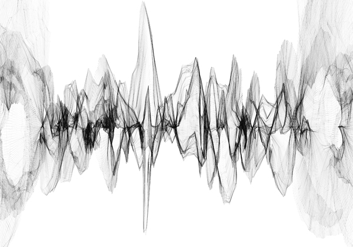

# Gender-based Vocal Recognition
> Final Project of CSYE7374
--- 



#### Members:
Shiqi Dai<br>
Wenqi Cui
#### Advisor:
Sri Krishnamurthy

--- 
## Table of Content

- [Topic Description](#topic-description)
- [Data Sources](#data-sources)
- [Pipeline Design](#pipeline-design)
- [Data Collection](#data-collection)
  + [What is TFRecord](#what-is-tfrecord)
  + [How to handle TFRecord?](#how-to-handle-tfrecord-)
  + [Label Filter](#label-filter)
- [Data Preprocessing](#data-preprocessing)
- [The Sound File: WAV](#the-sound-file--wav)
  + [Load a WAV file](#load-a-wav-file)
  + [Waveform](#waveform)
  + [Spectrogram](#spectrogram)
- [Classifiers Training](#classifiers-training)
  + [CNN(Convolutional Neural Network)](#cnn-convolutional-neural-network-)
  + [Ensemble](#Ensembel-)
  + [Optimization](#optimization)
  + [Evaluation](#evaluation)
- [New-coming WAV File Separation](#new-coming-wav-file-separation)
  + [Slicing](#slicing)
  + [Embedding](#embedding)
  + [Feeding to the Model](#feeding-to-the-model)
- [Future Steps](#future-steps)
  + [YouTube Data Collection](#youtube-data-collection)
  + [Silence Detection](#silence-detection)
- [References](#references)


## Topic Description

In Gender-based Vocal Recognition, we will design a classifier which is used to recognize the gender of a speaker from a given speech audio file(WAV format), in other words, to classify audio files to genders(male and female).

The data source is AudioSet provided by Google Research. It is a large scale audio dataset collected from YouTube videos. We will build machine learning models with TensorFlow,  trying some wildly used neural networks such as CNN, RNN. Different models for the model evaluation will be taken to obtain the best model. Afterward, our product will be able to process the newly coming WAV files, automatically applying feature engineering and generating training examples in memory-friendly data format. Finally, use our pre-trained neural network model to label it for future research usage.

Achievement of our project could be very valuable on video/audio labeling, and it will help to generate more data for further study. For example, building a separator to separate a conversation audio file into two part according to different speakers. Combined with IoT technology which becomes more and more popular these days, our project is helpful in empowering “smart home”. For example, virtual assistants, such as Siri or Alexa, can use our product to validate if the voice of a certain user has access. 

## Data Sources
> AudioSet is provided by Google Research. It consists of an expanding ontology of 632 audio event classes and a collection of 2,084,320 human-labeled 10-second sound clips drawn from YouTube videos.

We used 3 parts of data from AudioSet. They are:
  1. Male speech, man speaking  [link](https://research.google.com/audioset/ontology/male_speech_man_speaking_1.html)
  2. Female speech, woman speaking  [link](https://research.google.com/audioset/ontology/female_speech_woman_speaking_1.html) 
  3. Child speech, kid speaking  [link](https://research.google.com/audioset/ontology/child_speech_kid_speaking_1.html)
 
In which, 1, 2, and 3 will be used to train classifier(s) that recognize different types of human voice. 

## Pipeline Design

There two main parts in our project. 

First is `Classifier Training`. This part works as our core. It uses AudioSet data to train classifiers which will be used by the next part. 

The second part is `.wav Separation and Classification`. This part is for classfying and separation on future sound file. It will first apply preprocessing and feature engineering, then use the our classifier to predict, finally using our scoring criteria to mark the original wav file.


## Data Collection

Google Research offers the AudioSet dataset for download in two formats:
1. **Text (CSV) files** describing, for each segment, the YouTube video ID, start time, end time, and one or more labels.
2. **128-dimensional audio features** extracted at 1Hz. The audio features were extracted using a VGG-inspired acoustic model described in Hershey et. al., trained on a preliminary version of YouTube-8M. The features were PCA-ed and quantized to be compatible with the audio features provided with YouTube-8M. They are stored as TensorFlow Record files. 

To use the extracted features dataset, both of 1 and 2 need to be downloaded. 

#### 128-dimensional audio features
They are stored in 12,228 **TensorFlow record files**, shared by the first two characters of the YouTube video ID, and packaged as a tar.gz file. There are two ways provided by Google to download the features dataset(2):
- Manually download the tar.gz file
- Use gsutil rsync, with commands- 

The labels are stored as integer indices. They are mapped to sound classes via `class_labels_indices.csv`. 


#### Text (CSV) files
In the CSV file, 

The first line defines the column names. Subsequent lines describe the mapping for each class. For example: 

|index |mid      |display_name  |
| ---- | ------- | ------------ |
|0     |/m/09x0r |"Speech"      |


This means the index 0 indicates the label `“Speech”`.

### What is TFRecord
TFRecord is a binary storage file format introduced by TensorFlow.

The benefits of choosing TFRecord to store features is explained by Thomas Gamauf on [here](<https://medium.com/mostly-ai/TensorFlow-records-what-they-are-and-how-to-use-them-c46bc4bbb564>).

### How to handle TFRecord?

### Label Filter
When read in embedded features from TFRecord, due to the huge size of data and time consumption of loading data, we want to load only those samples with labels that satisfying our requirements to our system.

## Data Preprocessing

Data preprocessing is a vital part of our project. There are two reasons: First, machine learning is always affected deeply by the feature representation. The preprocessing plays an important role in representing the most remarkable feature of our data helping the classifier work efficiently and successfully. More importantly, audio data contains a large amount of information. Without preprocessing, there are not enough computational resources for us to train classifiers later.

#### Preprocessing on the downloaded dataset
For downloaded dataset, audio data(frame-level features) is stored in TensorFlow.SequenceExample protocol buffers in TFRecord files. 

A SequenceExample is an Example representing one or more sequences and some context. The context contains features which apply to the entire example. The feature_lists contain a key, value map where each key is associated with a repeated set of Features (a FeatureList). A FeatureList thus represents the values of a feature identified by its key overtime / frames.

All the feature information is extracted and represented already as embeddings by a pre-trained neural network model as feature extractor.


## The Sound File: WAV
>Waveform Audio File Format (WAVE, or more commonly known as WAV due to its filename extension; is a Microsoft and IBM audio file format standard for storing an audio bitstream on PCs. For more [details](<https://en.wikipedia.org/wiki/WAV>)

Usually, we care about two variables when loading a wav file. They are:

- **Frame**: An audio frame, or sample, contains amplitude (loudness) information at that particular point in time. To produce sound, tens of thousands of frames are played in sequence to produce frequencies.
- **Sampling Rate**: In the case of our audio data which is in CD quality audio, there are around 44,100 frames/samples per second, which means the sampling rate is 44.1kHz. This number is widely used today. 

By using `frames` and `sampling_rate`, we are able to calculate the duration of a wav file by simply taking `duration` = `frames` / `sampling_rate`.

Our project is taking 16-bits audio. This means each of those frames contains 16-bits of resolution, allowing for fairly precise representations of the sound levels. Also, because CD audio is stereo, there is actually twice as much information, 16-bits for the left channel, 16-bits for the right.

When you use the sound module in python to get a frame, it will be returned as a series of hexadecimal characters:

- Two characters for 16-bit mono.
- Four characters for 16-bit stereo.

We can use the python wave module's functions to check the bit depth and number of channels to prevent comparing mismatched quality settings.


### Load a WAV file
There are several python packages allow you to load a WAV file.
#### Using wave library
```python
import wave
wav = wave.open(fname)

frames = getnframes()
sampling_rate = getframerate()

duration = wav.getnframes()/wav.getframerate()

print("Sampling (frame) rate = ", wav.getframerate())
print("Total samples (frames) = ", wav.getnframes())
print("Duration = ", duration)
```
Output
```
Sampling (frame) rate =  44100
Total samples (frames) =  500224
Duration =  11.34294784580499
```

#### Using scipy
```python
from scipy.io import wavfile
rate, data = wavfile.read(fname)
print("Sampling (frame) rate = ", rate)
print("Total samples (frames) = ", data.shape)
print(data)
```
Output
```
Sampling (frame) rate =  44100
Total samples (frames) =  (500224, 2)
[[-5 -3]
 [ 2 -7]
 [-6 -6]
 ...
 [28 25]
 [26 25]
 [29 22]]
```
### Waveform
To visualize an audio data, we can plot its waveform.
```python
import matplotlib.pyplot as plt
plt.plot(data, '-', )
```
Output


Let's zoom in on first 50000 frames
```python
plt.figure(figsize=(16, 4))
plt.plot(data[:50000], '.'); plt.plot(data[:50000], '-')
```
Output


### Spectrogram
#### What is Spectrograms?
A spectrogram is a visual representation of the spectrum of frequencies of sound or other signal as they vary with time. 
#### Why use spectrograms?
Spectrograms of sounds turn out to be quite useful for training 2d convolutional networks. The feature extractor provided by Google Research also need to convert input data from audio waveform to mel spectrogram features.

#### Plot Spectrogram
To plot a spectrogram, we can use `pyplot`
```python
plt.specgram(data[:,0], Fs=sample_rate, xextent=(0,30))
plt.show()
```


## Classifiers Training
The main approach for the classifiers training will be neural-network-based. Typical neural network types will include CNN(Convolutional Neural Network), RNN(Recurrent Neural Network). Certain customization will be taken if necessary. 

### CNN(Convolutional Neural Network)
Typically, CNN is used on image/audio data. It plays a vital role in cognitive computing like image/voice recognition. 

#### VGG-ish Architecture
The reason we choose to use a VGG-ish architecture is mainly because it is famous.


### LSTM(Long Short-Term Memory Neural Network)
Long short-term memory (LSTM) units are units of a recurrent neural network (RNN). An RNN composed of LSTM units is often called an LSTM network.

### Optimization
We would compare different optimizers including SGD, SGD with momentum, Adam, RmsProp, etc.

### Evaluation

#### Loss Function and Metrics
Our task is a three-class classification(man, woman, and child). Because of the usage of artificial neural networks, we would choose categorical cross-entropy as our loss function. 
For metrics, confusion-matrix-related metrics will be taken. This will include accuracy, recall, precision, and categorical accuracy.

#### Testing and Validation
Based on the scale of the provided data(17,716 man speaking, 8,513 woman speaking, 11,816 child speaking), we would choose hold-out validation.


## New-coming WAV File Separation
For future data which needs to be predicted, we assume the audio file is in the type of WAV. For WAV files, we would apply slicing to split the audio into several slices which can meet the input shape of our pre-trained model and use the same strategy to do the feature engineering, extracting features. This process will follow the steps below, a WAV file is: 
- read in with `wavfile` provided by `Scipy.io`
- slice into several pieces
- converted into spectrogram examples
- feed into the pre-trained VGGish model to generate embeddings
- post-processed to generate whitened and quantized embeddings(represented features)
- normalization
- predicted by classifier(s)
- Calculate predictions
- Give recommendation for audio separation


### Slicing
There are two reasons that we need to slice new-coming WAV files:
1. To make sure the input data that is going to feed into our model has a uniformed shape, which means new-coming audio files with any lengths larger than the size of slicing window would be predictable for our model.
2. To reach our goal--audio separation, we would like to predict on every period of an audio file. Then based on the predictions, we can give recommendation for the separation.

To slice an audio file(WAV), we need to firstly calculate its duration by extracting the data frames and sampling rate.
```python
from scipy.io import wavfile

rate, data = wavfile.read(fname)
duration = len(data)/rate
```
Then set a window duration, and based on that, calculate window size as well. In our project, we set the window duration as 10, which means we would predict on every 10 seconds. 
```python
sample_rate = rate #44,100 (44.1kHZ)
window_duration = 10
window_size = int(window_duration * sample_rate)
```
Once window duration get set, we can set a step duration and calculate the corresponding step size. We set the step duration as 1/10 of window duration, which is 1 sceond. 
```python
step_duration = window_duration / 10  # 1s
step_size = int(step_duration * sample_rate)
```
This means the window will move 1 second by 1 second. It works like the kernel in CNN, but the difference is that our window do not calculate. It is just used to resampling. 

Now we can call the slice method to split.
```python
def slice(signal, window_size, step_size):
    if type(window_size) is not int:
        raise AttributeError("Window size must be an integer.")
    if type(step_size) is not int:
        raise AttributeError("Step size must be an integer.")
    windows = []
    times = []
    for i_start in range(0, len(signal), step_size):
        i_end = i_start + window_size
        if i_end >= len(signal):
            break
        times.append((i_start,i_end))
        windows.append(signal[i_start:i_end])
    return windows, times
```

### Embedding
After slicing, we would get several pieces of waveform. These waveforms is going to be our input samples waiting for prediction. Before that, embedding is necessary. There are three reasons:
1. In audio/sound processing, waveform does not represent the data well, in order to feed the data into neural networks. Normally, researchers would transform waveform to spectrogram which is better for neural network to learn.
2. However, both waveform and spectrogram contain too many information. It will be super expensive if waveform/spectrogram is directly fed into neural networks. Thus, further feature engineering is required. Feature embedding is one of them. 
3. Our model is trained on sample in embeddings provided by Google research. Those embeddings are generated based on a pre-trained VGG-ish neural network model with YouTube 8M audio data. Thus, our classifier(s) only accepts input with the same size as the provided embeddings and needs the value of embeddings is generated by the same method.

Because of the three points above, we are required to use the same embedding strategy. Fortunately, Google Research has released a version of their VGG-ish model and weights to let researchers use their embeddings. 
>Note: Google Research pointed out that the released version of embeddings is a little bit different from the version which is used to embed AudioSet data. This may cause some difficulties to achieve the same performance on the prediction of new-coming audio data.

To use the VGG-ish model as feature extractor, we can use the given API as below:
```python
examples_batch = vggish_input.waveform_to_examples(norm_wavform_slice,rate)

# Prepare a postprocessor to munge the model embeddings.
pproc = vggish_postprocess.Postprocessor(FLAGS.pca_params)

with tf.Graph().as_default(), tf.Session() as sess:
  # Define the model in inference mode, load the checkpoint, and
  # locate input and output tensors.
  vggish_slim.define_vggish_slim(training=False)
  vggish_slim.load_vggish_slim_checkpoint(sess, FLAGS.checkpoint)
  features_tensor = sess.graph.get_tensor_by_name(
  vggish_params.INPUT_TENSOR_NAME)
  embedding_tensor = sess.graph.get_tensor_by_name(
  vggish_params.OUTPUT_TENSOR_NAME)
  
  # Run inference and postprocessing.
  [embedding_batch] = sess.run([embedding_tensor],
                   feed_dict={features_tensor: examples_batch})
                   
  postprocessed_batch = pproc.postprocess(embedding_batch)

return postprocessed_batch
```

### Feeding to the Model
Before feed data into model, some conversions and normalizations need to be done.
```python
#convert to float and normalize
embeded_windows = embeded_windows.astype('float32')
embeded_windows /= 255
```
Besides, the input shape may differ from models. We carefully reshaped them according to different input shape. In neural network, shape is a very important thing. You have to keep "shape" in mind in anytime!


## Future Steps
### YouTube Data Collection 
We have noticed that there is some way to fetch WAV data from YouTube by an API. Since we've got the IDs, start and end timestamps of the videos, it is possible to fetch WAV files to generate raw WAV dataset from YouTube. This will give us more freedom on the exploration of audio feature engineering. Here is the GitHub repo of 
[Fetch wav data from audioset](<https://github.com/unixpickle/audioset/tree/bddd5c7e5d6e8b6fb565943ec5c608c3a8c7f8e7>)

### Silence Detection 
The audio quality of AudioSet is not very satisfying. A typical weakness is silence. For example, some samples labeled as child speaking may contain up to 1/3 silence/small noise, no kids' voice at all. This makes our model difficult to learn well. We've found some solution on this issue which is silence detection. It can be seen as another preprocessing on the input audio files, which is able to detect silence based on the energy of waveform. In the future, we've planed to add this feature into our system, making our audio separation system robuster.

--- 
## References
[1] Gemmeke, Jort F., et al. “Audio Set: An Ontology and Human-Labeled Dataset for Audio Events.” 2017 IEEE International Conference on Acoustics, Speech and Signal Processing (ICASSP), 2017, doi:10.1109/icassp.2017.7952261.

[2] Hershey, Shawn, et al. “CNN Architectures for Large-Scale Audio Classification.” 2017 IEEE International Conference on Acoustics, Speech and Signal Processing (ICASSP), 2017, doi:10.1109/icassp.2017.7952132.

[3] Ephrat, Ariel, et al. “Looking to Listen at the Cocktail Party.” ACM Transactions on Graphics, vol. 37, no. 4, 2018, pp. 1–11., doi:10.1145/3197517.3201357.

[4] Google. “Google/Youtube-8m.” GitHub, 5 Nov. 2018, github.com/google/youtube-8m.
DTaoo. “DTaoo/VGGish.” GitHub, 30 Nov. 2017, github.com/DTaoo/VGGish.

[5] “Looking to Listen: Audio-Visual Speech Separation.” Google AI Blog, 11 Apr. 2018, ai.googleblog.com/2018/04/looking-to-listen-audio-visual-speech.html.

[6] Acapella Extraction with ConvNets, madebyoll.in/posts/cnn_acapella_extraction/.

[7] AIFF / AIFC Sound File Specifications, www-mmsp.ece.mcgill.ca/Documents/AudioFormats/.

[8] Rogerdettloff. “Rogerdettloff/speech_seg_sep.” GitHub, 28 Sept. 2017, github.com/rogerdettloff/speech_seg_sep.

[9] Gamauf, Thomas. “TensorFlow Records? What They Are and How to Use Them.” Medium.com, Medium, 20 Mar. 2018, medium.com/mostly-ai/TensorFlow-records-what-they-are-and-how-to-use-them-c46bc4bbb564.
